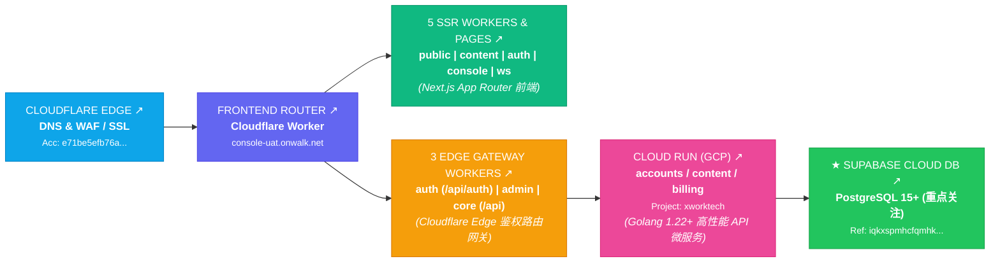

# 架构路由与云原生控制台直达 (Architecture Traffic Route & Cloud Consoles)

本文档 1:1 对齐架构链路截图，说明 Next.js 前端、Go 微服务、Supabase PostgreSQL 与 Cloudflare / Cloud Run 的完整拓扑流转。

---

## 链路分层职责与技术栈映射

### 1. 边缘入口层：CLOUDFLARE EDGE
- **DNS & WAF / SSL** (Account: `e71be5efb76a...`)
- 职责：泛解析接入、DDoS 缓解、TLS 1.3 终结与边缘速率限制。

### 2. 路由分发层：FRONTEND ROUTER
- **Cloudflare Worker** 绑定域名：`console-uat.onwalk.net`
- 配置文件：`deploy/cloudflare/router-worker.js` 与 `wrangler.toml`
- 策略：
  - 静态页面及控制台路由 (`/`, `/console/*`, `/auth/*`, `/ws`) 分流至 **5 SSR Workers & Pages**；
  - 核心业务与控制面接口 (`/api/*`, `/api/auth/*`) 分流至 **3 Edge Gateway Workers**。

### 3. 应用控制台层：5 SSR WORKERS & PAGES
- **技术栈**：Next.js 14+ (App Router, Tailwind CSS, TypeScript, Standalone Output)
- 源码目录：`frontend/`
- 承载功能：
  - 顶部个人信息 HP 头像名片与 5 维胶囊指标卡片；
  - 7 行 × 50 列超紧凑贡献热力图矩阵；
  - 177 国真实主权边界的高精度矢量地理地图（Requests by country）与实时排行；
  - 4 维安全性加密与 Zero Trust 遥测指标。

### 4. 接口网关层：3 EDGE GATEWAY WORKERS
- 职责：边缘轻量 JWT 校验、设备合规探针预检、统一 CORS 注入，并转发至 Google Cloud Run。

### 5. 核心计算层：CLOUD RUN (GCP)
- **技术栈**：Go 1.22+ (标准库 + 高并发微服务架构)
- **GCP 项目**：`xworktech`
- 源码目录：`backend/`
- 镜像打包：`backend/Dockerfile` (Distroless 极简容器，冷启动 < 200ms)
- 核心功能：
  - 提供 `/api/v1/metrics/summary`、`/api/v1/telemetry`、`/api/v1/geo/stats`；
  - 运行 `sync` 动态爬虫模块，直连 Linode (`/v4/regions`)、Vultr (`/v2/regions`) 进行实时状态对账与 RTT 探测；
  - 跨云 WireGuard 隧道编排与动态故障切换调度。

### 6. 数据存储层：★ SUPABASE CLOUD DB
- **技术栈**：PostgreSQL 15+ (Project Ref: `iqkxspmhcfqmhk...`)
- 数据库脚本：`database/schema.sql`、`database/seed.sql`
- 核心数据表：
  - `vps_providers` (5 大运营商元数据)
  - `mesh_nodes` (48 个核心数据中心 PoP 节点与实时延时)
  - `node_capabilities` (7 维算力、架构与计费能力)
  - `geo_country_stats` (全球 15+ 重点国家流量与节点榜单)
  - `telemetry_snapshots` (加密请求率与时序数据)
