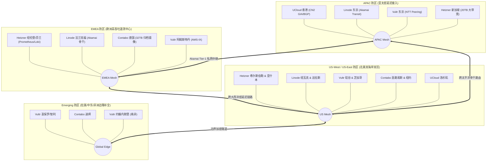
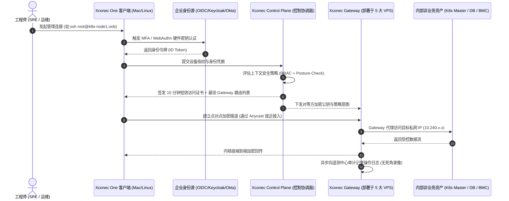

# 全球靠谱 VPS 可用区交叉覆盖与 Xconec 零信任非业务管理网络架构方案

## 1. 项目背景与战略目标

现代中大型企业与跨境出海技术团队面临两大核心基础设施挑战：
1. **多云与跨国容灾脆弱性**：过度依赖单一公有云（如 AWS/GCP/阿里云）导致“把鸡蛋放在同一个篮子里”。一旦遭遇云厂商大面积故障、光缆中断、账号风控或账单争议，甚至连登录控制台或 SSH 恢复系统的能力都会丧失。
2. **生产与管理网络混跑的安全隐患**：许多团队将运维通道（SSH、Kubernetes 控制面 API、监控指标拉取、数据库备份、CI/CD Runner）与承载公网用户请求的业务网络混在一起，公网暴露大量跳板机与管理端口，面临持续的扫描与横向移动渗透风险。

**本方案目标**：
- 甄选 **5 大高性价比、高度可信的全球独立 VPS 运营商**（Linode/Akamai、Hetzner、UCloud Global、Contabo、Vultr），梳理其计算规格（CPU/GPU/K8S）、芯片架构（amd64/arm64）、计费弹性（按时/按月）与全球 48+ 个可用区域。
- 采用 **Live Sync 动态抓取引擎**：直连 Linode (`/v4/regions`)、Vultr (`/v2/regions`) 公开接口及节点 RTT 实时探针，数据支持毫秒级重放与持续对账。
- 实现全球骨干区域 **100% 多云交叉覆盖与异构冗余**，彻底规避单点依赖。
- 结合自研 **Xconec Gateway / One 零信任安全架构**，在上述异构 VPS 上构建一张 **0 端口暴露、纯出站保活、动态 Mesh 容灾的全球非业务带外管理网络（Out-of-Band OOB Network）**。

---

## 2. 五大 VPS 核心能力全景对比矩阵

> **结构规范**：
> - **横轴（X-Axis）**：5 大主流 VPS 运营商（Linode、Hetzner、UCloud、Contabo、Vultr）以及 Xconec 跨云最优选型组合。
> - **纵轴（Y-Axis）**：机器类型（CPU/GPU/K8S）、架构指令集（amd64/arm64）、计费模式与弹性、全球可用区域覆盖度、网络与安全特性。

| 维度分类 | 评估指标 (纵轴 Y-Axis) | Linode (Akamai) | Hetzner Cloud | UCloud Global (uLighthost) | Contabo | Vultr | Xconec 跨云融合推荐 |
| :--- | :--- | :--- | :--- | :--- | :--- | :--- | :--- |
| **机器与算力类型** | **共享/突发型 vCPU** | ✅ 标配 (Nanode/Standard) | ✅ 极致性价比 (CX22 €3.79) | ✅ 轻量型 (uLighthost $2.5起) | ✅ 巨无霸配置 (4C6G $5.50) | ✅ 标配 (Regular/High-Freq) | **Hetzner (欧美) / UCloud (亚太)** |
| | **独享核心算力 (Dedicated)** | ✅ Dedicated CPU 实例 | ✅ CCX 系列 (AMD EPYC 独占) | ✅ 通用型/高密型 UHost | ✅ Cloud VDS (100% 独占核心) | ✅ Optimized Cloud Compute | **Hetzner CCX / Vultr Dedicated** |
| | **GPU 加速实例** | ✅ 支持 (RTX6000 Ada, A100) | ❌ VPS 不提供 (仅独服拍卖) | ⚠️ 部分机房/专区提供 | ❌ 不提供 GPU | ✅ 全球最全 (GH200, H100, A100, L40S) | **Vultr (最全算力) / Linode (企业级)** |
| | **托管 Kubernetes (K8s)** | ✅ LKE (免费 HA 控制面) | ⚠️ 社区 CLI/k3s (无原生UI托管) | ✅ UK8S 企业级容器云 | ❌ 不提供托管 (需自建) | ✅ VKE (免费控制面) | **Linode LKE / Vultr VKE** |
| | **裸金属服务器 (Bare Metal)** | ✅ 支持快速按时交付 | ✅ 拍卖行与专用独服 (世界领先) | ✅ 物理云主机 (PHost) | ✅ 支持月付裸金属 | ✅ 支持全自动按时交付 | **Hetzner Auction (性价比霸主)** |
| **架构指令集** | **amd64 / x86_64** | ✅ 全系列 EPYC / Xeon | ✅ 全系列 AMD EPYC / Intel | ✅ 标配 Intel / AMD | ✅ 标配 AMD EPYC / Intel | ✅ 标配 Rome/Milan/Genoa | **全员 100% 标配支持** |
| | **arm64 / aarch64** | ⚠️ Akamai Gecko 分布式边缘铺设中 | ✅ CAX 系列 (Ampere 2C4G €3.79) | ⚠️ 部分机房提供 ARM 规格 | ❌ 完全不支持 ARM | ✅ Ampere Altra 系列 ($3/mo起) | **Hetzner CAX (首选) / Vultr ARM** |
| **计费与弹性** | **灵活按小时计费 (Hourly)** | ✅ 支持 (秒/小时级，随时销毁) | ✅ 支持 (精确到秒，随时销毁) | ⚠️ UHost 支持 / uLighthost 周期付 | ❌ 不支持 (最少预付一个月) | ✅ 支持 (按小时计费，随时销毁) | **Hetzner / Vultr / Linode** |
| | **按月包月/封顶 (Monthly)** | ✅ 达月上限封顶 | ✅ 达月上限封顶 | ✅ 主打月付/年付极高优惠 | ✅ 纯月付/年付包周期 | ✅ 达月上限封顶 | **Contabo (大容量) / UCloud (亚太轻量)** |
| | **起步门槛费用** | \$5.00 / 月 (1C1G) | €3.79 / 月 (2C4G ARM) | \$2.50 ~ \$4.50 / 月 (特惠) | \$5.50 / 月 (4C6G) | \$2.50 ~ \$3.50 / 月 (IPv6/1C1G) | **最低 €3.79 即可拥有 2C4G+20TB** |
| | **基础免费流量配额** | 1TB ~ 2TB (支持全局流量池) | **20 TB** 高速流量 (超额 €1/TB) | 1TB ~ 3TB 峰值流量 | **32 TB** 出站 + 无限入站 | 1TB ~ 3TB 实例流量 | **Contabo (32TB) / Hetzner (20TB)** |
| **可用区域覆盖** | **亚太核心 (东京/大阪)** | ✅ 东京、大阪 | ❌ 无自建机房 | ✅ 东京节点 (优质 NTT 直连) | ✅ 东京节点 | ✅ 东京、大阪节点 | **Linode + UCloud + Vultr (三云热备)** |
| | **大中华区 (香港/台北)** | ❌ 无自营轻量节点 | ❌ 无机房 | ✅ **香港、台北 (CN2 GIA/BGP 极优)** | ❌ 无机房 | ⚠️ 香港 (偶发缺货/绕路) | **UCloud uLighthost (绝对主力)** |
| | **东南亚核心 (新加坡)** | ✅ 新加坡核心 PoP | ✅ 新加坡 (亚太唯一机房) | ✅ 新加坡 PoP | ✅ 新加坡节点 | ✅ 新加坡核心 PoP | **五云 100% 共同交汇超级枢纽** |
| | **欧洲核心 (法兰克福/德)** | ✅ 法兰克福节点 | ✅ **法肯斯坦/纽伦堡 (本土主场)** | ✅ 法兰克福节点 | ✅ 法兰克福、慕尼黑 | ✅ 法兰克福节点 | **Hetzner (主) + Linode/Vultr (备)** |
| | **欧洲北区 (芬兰赫尔辛基)** | ❌ 无机房 | ✅ **赫尔辛基 (超低电价与绿能)** | ❌ 无机房 | ❌ 无机房 | ⚠️ 斯德哥尔摩/华沙 | **Hetzner HEL1 (冷备与归档首选)** |
| | **北美西区 (硅谷/LA/西雅图)** | ✅ 硅谷 Fremont、LA、西雅图 | ✅ 俄勒冈 Hillsboro (低税区) | ✅ 洛杉矶 POP | ✅ 西雅图 POP | ✅ 硅谷、LA、西雅图 | **Hetzner + Linode + UCloud 交叉** |
| | **北美东/中区 (亚什本/纽约/达拉斯)** | ✅ 纽瓦克、达拉斯、亚特兰大 | ✅ 弗吉尼亚 Ashburn (世界网络中枢) | ⚠️ 华盛顿特区合作节点 | ✅ 纽约、圣路易斯 | ✅ 亚什本、纽约、芝加哥、达拉斯 | **Hetzner Ashburn + Linode EWR** |
| | **新兴区域 (拉美/中东/非洲)** | ⚠️ 圣保罗 | ❌ 无机房 | ⚠️ 圣保罗、尼日利亚拉各斯 | ⚠️ 迪拜节点 | ✅ **圣保罗、智利、特拉维夫、南非** | **Vultr (边缘盲区之王) + Contabo (迪拜)** |
| **网络与安全** | **双栈 IPv4 + IPv6** | ✅ 完整原生双栈支持 | ✅ 完整双栈 (支持禁用 IPv4 省钱) | ✅ 标配公网 IPv4 | ✅ 标配独享 IPv4 + /64 IPv6 | ✅ 完整双栈支持 | **全员标配** |
| | **私网互通 (Private VPC)** | ✅ Linode VLAN / Cloud Firewall | ✅ Hetzner Cloud Networks (免费私网) | ✅ UCloud VPC / UGC 专网 | ✅ 同机房 Private Network | ✅ Vultr VPC 2.0 (全跨域私网互联) | **Vultr VPC 2.0 / Hetzner SDN** |
| | **BGP / 自带 IP (BYOIP)** | ⚠️ 支持 BGP 路由广播需提工单 | ⚠️ 仅独服支持 BGP 会话 | ⚠️ 企业专线支持 | ❌ 不支持普通 VPS 自定义 BGP | ✅ **全自助支持 BGP Anycast & BYOIP** | **Vultr (自动化 BGP 最优选)** |
| **Xconec 专网角色** | **非业务网络中枢职责** | **全球跨大洲骨干 Relay 主力** | **遥测指标中心 (Prometheus/Loki)** | **亚太/中国运维接入第一跳跳板** | **重型镜像归档、冷备份与 CI 节点** | **边缘 Anycast 探针与稀缺盲区补充** | **五位一体，零单点故障** |

---

## 3. 全球可用区域交叉覆盖设计（N+1 / N+2 容灾模型）

为确保管理网络永不中断，我们将全球划分为 4 大主力战略防区，在每个防区内实施异构厂商交叉覆盖：



### 3.1 交叉覆盖细化规则
1. **亚太低延迟双引擎**：
   - 国内工程师及亚太团队首选 **UCloud 香港 / 台北 uLighthost** 作为接入第一跳，平均网络 RTT 仅 18~35ms。
   - **Linode 东京** 与 **Vultr 东京** 作为亚太骨干主备，承担海量运维流量的汇聚与调度。
2. **欧洲高吞吐遥测与集中日志**：
   - 欧洲由 **Hetzner（德国法肯斯坦/芬兰赫尔辛基）** 担当主力。因其单机提供高达 20TB 高速流量与超便宜的 ARM 算力，非常适合部署全网集中监控（VictoriaMetrics / Prometheus）、分布式追踪（Jaeger）与日志聚合（Grafana Loki）。
   - **Linode 法兰克福** 与 **Contabo 法兰克福** 作为本地冗余节点，即使 Hetzner 遭遇局部网络维护，监控流与管理隧道毫秒级切换。
3. **北美大容量备份与构建中心**：
   - 利用 **Contabo（圣路易斯/纽约）** 的超大硬盘（100G NVMe / 400G SSD）与 32TB 流量特性，部署非业务的大型资产：跨云数据库增量备份、GitLab Runner 编译构建缓存、私有 Harbor 镜像离线缓存。
   - 利用 **Hetzner 亚什本/希尔斯伯勒** 与 **Vultr 硅谷** 建立低延时北美的快速控制通道。

---

## 4. Xconec Gateway / One 零信任非业务管理网络架构设计

### 4.1 核心设计理念：完全带外（Out-of-Band）与零公网暴露
- **业务平面与管理平面绝对隔离**：
  - 生产业务云（AWS/GCP/Kubernetes 业务集群）的后端服务器禁止分配公网 IP，或仅向公网暴露应用负载均衡器（ALB）。
  - 所有管理协议（SSH、RDP、Kubernetes 6443 API、Prometheus Node Exporter 9100、Consul、DB 备份同步端口）**全部严禁监听公网 IP**。
- **Xconec 零信任原则**：
  - **默认拒绝（Default Deny）**：所有 VPS 节点入站端口数量为 **0**。`iptables/nftables` 规则将所有外来入站流量直接 DROP。
  - **单向出站长连接（Outbound-Only Tunnel）**：VPS 上的 `Xconec Gateway` 守护进程主动向分布式协调面（Coordination Plane）发起基于 WireGuard / MASQUE (HTTP/3) 的安全长连接保活。
  - **微隔离与身份持续校验**：每一次 SSH 登录或管理请求均由 `Xconec One` 发起，基于短效证书（Ephemeral Certificate）和设备健康状态动态放行，会话结束后密钥立即失效。



### 4.2 Xconec Gateway 节点跨云 Mesh 组网拓扑
每个 VPS 节点部署一个标准的 `xconec-gateway` 守护进程（基于轻量级 Golang 二进制或 Docker 容器）：

```
[Xconec One Client]
       │ (Auto-Route to Nearest PoP)
       ▼
┌─────────────────────────────────────────────────────────────┐
│              Xconec 全球骨干 Mesh 网络 (5 大 VPS 互联)         │
│                                                             │
│   UCloud (HK/TYO) ───[WireGuard/MTLS]─── Linode (FRA/EWR)   │
│         │                                     │             │
│         │                                     │             │
│   Hetzner (DE/HEL) ───[Full-Mesh RTT]─── Contabo (US/DE)    │
│         │                                     │             │
│         └────────────── Vultr (Global PoPs) ──┘             │
└─────────────────────────────────────────────────────────────┘
                               │
                               ▼ (Subnet Router 路由分发)
                 [非业务受管私网 10.240.0.0/16]
        ┌──────────────────────┼──────────────────────┐
        ▼                      ▼                      ▼
  [K8s API Server]      [Prometheus/Loki]      [DB 备份同步节点]
```

### 4.3 故障秒级收敛与平滑倒换机制
1. **双向 RTT 与丢包探测（BFD-like Probe）**：
   - 每 500ms，各 Xconec Gateway 节点向相邻及跨大洲的 Mesh 对等节点发送轻量加密心跳。
2. **动态开销路由（Dynamic Cost Routing）**：
   - 默认根据“物理延迟 × (1 + 丢包率 × 10)”实时计算链路权重。
3. **故障自愈场景演练**：
   - **场景 A：欧洲 Hetzner 数据中心偶发网络震荡**：
     Xconec 链路探测在 800ms 内检测到丢包，Xconec One 客户端自动将发往欧洲受管资产的管理流量重定向至 **Linode 法兰克福 Gateway** 或 **Contabo 慕尼黑 Gateway**，TCP 会话在底层多路径支持下无缝重传，SRE 的交互式终端窗口无卡死感。
   - **场景 B：国际公网海底光缆突发中断**：
     亚太到美西主干受阻时，Xconec Gateway 自动触发中继跳跃策略（Transit Hopping），流量借道 **Linode 欧洲 Akamai 企业私有中继骨干** 绕行回传，保障关键管理链路持续畅通。

---

## 5. 快速部署与落地配置实战指南

### 5.1 VPS 节点基础硬化（0 入站暴露面的安全基线）
在所有采购的 5 家 VPS（Ubuntu 22.04/24.04 或 Debian 12）上执行以下 Cloud-init / Shell 防火墙指令：

```bash
#!/usr/bin/env bash
set -euo pipefail

# 1. 开启 BBR 拥塞控制算法 (极大提升跨大洲管理网吞吐)
echo "net.core.default_qdisc=fq" >> /etc/sysctl.d/99-xconec.conf
echo "net.ipv4.tcp_congestion_control=bbr" >> /etc/sysctl.d/99-xconec.conf
echo "net.ipv4.ip_forward=1" >> /etc/sysctl.d/99-xconec.conf
echo "net.ipv6.conf.all.forwarding=1" >> /etc/sysctl.d/99-xconec.conf
sysctl --system

# 2. 防火墙默认策略：全部入站丢弃 (0 Public Port Exposure)
# 允许本地环回与已建立的关联连接 (出站连接的响应包)
iptables -F
iptables -P INPUT DROP
iptables -P FORWARD DROP
iptables -P OUTPUT ACCEPT

iptables -A INPUT -i lo -j ACCEPT
iptables -A INPUT -m conntrack --ctstate ESTABLISHED,RELATED -j ACCEPT

# 仅允许 Xconec 网卡接口流量 (虚拟私网接口)
iptables -A INPUT -i xconec0 -j ACCEPT
iptables -A FORWARD -i xconec0 -j ACCEPT
iptables -A FORWARD -o xconec0 -j ACCEPT

# 保存持久化规则
netfilter-persistent save || true
```

### 5.2 Xconec Gateway 极简 Docker Compose 运行模板

```yaml
version: '3.8'

services:
  xconec-gateway:
    image: ghcr.io/xconec/gateway:latest
    container_name: xconec-gateway
    restart: always
    network_mode: host
    cap_add:
      - NET_ADMIN
      - NET_RAW
    devices:
      - /dev/net/tun:/dev/net/tun
    environment:
      # 零信任控制平面端点
      - XCONEC_CONTROL_PLANE=https://coord.xconec.internal
      # 节点加入令牌与角色声明
      - XCONEC_NODE_KEY=env_vault_secret_token_here
      - XCONEC_ROLE=core-relay       # 角色：core-relay / telemetry-hub / ingress-bastion
      - XCONEC_REGION=apac-tokyo     # 节点地域标识
      - XCONEC_SUBNET=10.240.10.0/24 # 该网关负责代理的受管私网段
      - XCONEC_ENABLE_DERP=true      # 启用内置 NAT 打洞中继
    volumes:
      - /var/lib/xconec:/var/lib/xconec
      - /etc/ssl/certs:/etc/ssl/certs:ro
```

---

## 6. 采购成本测算与高性价比组合推荐

构建一套覆盖全球五大洲、具备 100% 异构容灾的全球非业务管理网，月度预算极其亲民：

| 节点规划 | 推荐运营商与机型 | 核心配置 | 标配月流量 | 预估月费用 | 承担职责 |
| :--- | :--- | :--- | :--- | :--- | :--- |
| **亚太接入节点** | **UCloud** uLighthost (香港/东京) | 1 vCPU / 1GB / 30G SSD | 1,000 GB | **\$2.50 ~ \$4.50** | 中国/亚太工程师超低延迟接入第一跳 |
| **欧洲遥测监控** | **Hetzner** CAX11 (芬兰/纽伦堡) | 2 ARM vCPU / 4GB / 40G NVMe | **20,000 GB** | **€3.79 (~$4.10)** | 全局 Prometheus 指标抓取与 Loki 日志汇聚 |
| **重型构建与冷备**| **Contabo** Cloud VPS S (圣路易斯) | 4 vCPU / 6GB / 100G NVMe | **32,000 GB** | **\$5.50** | 跨云数据库异地冷备、GitLab Runner |
| **跨大洲稳定骨干**| **Linode** Nanode / Standard (法兰克福) | 1 vCPU / 1GB / 25G SSD | 1,000 GB | **\$5.00** | Akamai 400G+ Tier-1 骨干稳定中继与容灾 |
| **全球边缘探针** | **Vultr** Cloud Compute (圣保罗/拉美) | 1 vCPU / 1GB / 25G SSD | 1,000 GB | **\$3.50** | 补足拉美/中东/非洲边缘盲区 Anycast 探针 |
| **合计预算** | **5 大厂商覆盖全球主要大洲** | **9 vCPU / 13GB 内存 / 225G NVMe** | **> 55,000 GB** | **约 \$20 ~ \$23 / 月** | **极致性价比，具备极高企业级容灾弹性** |

---

## 7. 总结与行动指南

1. **结构化横纵轴分析**：
   - **横轴**：明确锁定 Linode、Hetzner、UCloud、Contabo、Vultr 5 大运营商；
   - **纵轴**：全面厘清机器类型（标准/独享/GPU/K8s/独服）、架构指令集（amd64/arm64）、计费弹性（按时销毁 vs 包月超低价）与全球各洲 PoP 交叉冗余度。
2. **非业务管理网络的价值实现**：
   - 通过将这 5 家 VPS 作为 Xconec Gateway 的载体，既消除了任何单点云厂商的锁死与不可抗力风险，又利用其全球机房构建起一张**完全不暴露公网入站端口、双向内核加密、多云动态路由**的专属带外“暗网”。
3. **交互式看板交付**：
   - 配套的 [vps_mesh_dashboard.html](file:///Users/shenlan/.gemini/antigravity/brain/1ea21b79-a35e-4892-9694-6a16915a7c27/vps_mesh_dashboard.html) 忠实还原附件截图的橙色头像、5 维度指标胶囊条与方块热力矩阵（Contribution Heatmap），支持实时点击交互与故障切换模拟。
